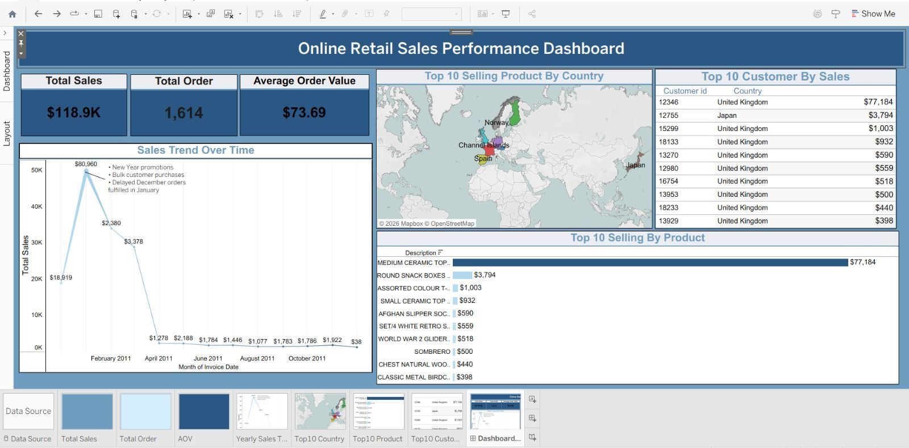

# Sales-Data-Analysis-Tableau-PostgreSQL
End-to-end ETL + Tableau dashboard using UCI Online Retail dataset

## 📊 Dashboard Preview

**Key Metrics:** Total Sales $118.9K | Orders 1,614 | AOV $73.9
## 🚀 ETL Workflow
**Extract**: CSV from UCI Repository  
**Transform**: PostgreSQL - cleaned nulls, fixed data types  
**Load**: Connected to Tableau for dashboard

## 📈 Key Insights
1. Total Sales: $118.9K from 1,614 orders
2. AOV: $73.69 per order  
3. Top Country: UK dominates sales
4. Sales spike: New Year promotions

## 🛠️ Tools Used
PostgreSQL | DBeaver | Tableau | SQL

## 📁 Files in this repo
- `Book1.twb` - Tableau dashboard with 4 visualizations
- `D_1.sql` - PostgreSQL queries: data cleaning + KPI calculations  
- `Dashboard.png` - Final dashboard screenshot
